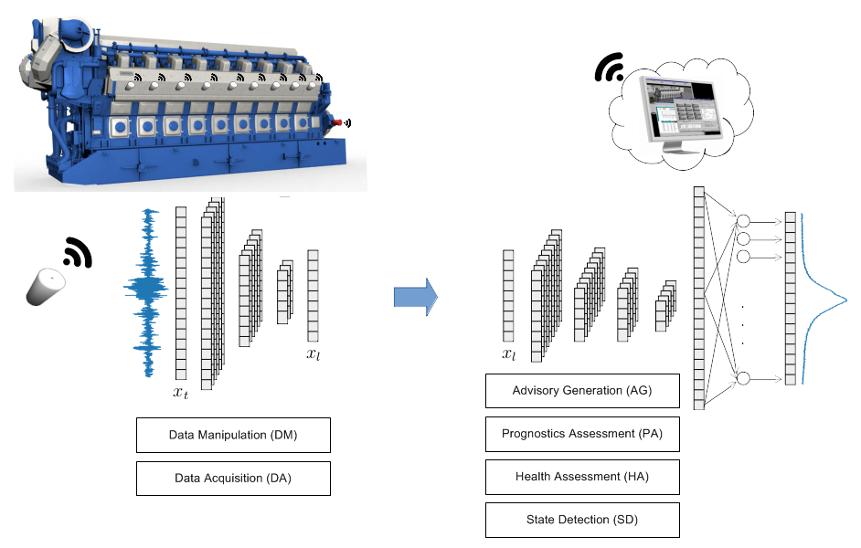
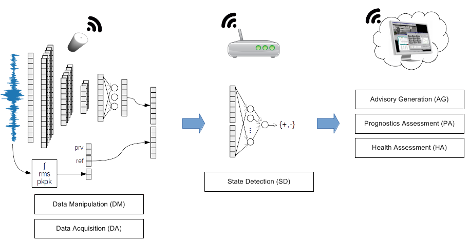

### Edge Computing for Smart Machine Health Monitoring Systems

**Pressure Reconstruction**

**Rotating Machine Classification**

[Report (full text - pdf)](tese.pdf)

### Abstract

Machine health monitoring systems aim to enhance industrial processes efficiency, increasing 
productivity and reducing unexpected downtime of the production lines. But
such systems are often designed as networks that gather a huge amount of data from
connected machines and turn the big machinery data available for high level interpretation 
and analysis in the cloud servers. In this thesis, a Wavelet Convolutional Neural
Network (WCNN) is proposed as the fundamental model of a deep learning algorithm designed 
for feature extraction of the vibration signal, to be embedded on limited vibration
sensors hardware. It enables to implement the concept of edge computing, that directs
computational data processing to the edge of a network and is characterized in terms of
high bandwidth, low latency, and faster access to the network information. Based on the
WCNN proposed, two distinct applications are developed to demonstrate the efficiency of
the edge computing based system. The first application is for large internal combustion
engines monitoring, with deep Wavelet Convolutional Autoencoder (WCAE) for feature
extraction and a Wavelet Convolutional Neural Network (WCNN) for in-cylinder pressure
reconstruction and parameter estimation. The second application is for industrial rotating
machinery monitoring, with deep Wavelet Convolutional Imbalanced Classifier (WCIC)
for feature extraction and fault detection directly on the edge devices. Both applications
show promising results for implementing practical machine health monitoring systems in
the Industrial Internet of Things (IIot) context. The edge computing benefits are observed
and the literature open issues are considered and contemplated in the architecture and
models proposed.

<a href="../projetos">Back</a>