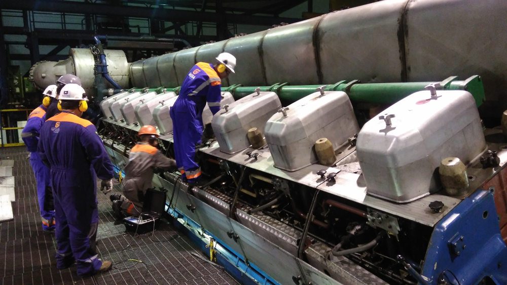

<iframe width="560" height="315" src="https://www.youtube.com/embed/Z_YjTRH8U00" title="YouTube video player" frameborder="0" allow="accelerometer; autoplay; clipboard-write; encrypted-media; gyroscope; picture-in-picture" allowfullscreen></iframe>

### R&D PROJECT PD-6492-0215/2015

- **Title:**	ANÁLISE DA CONDIÇÃO MECÂNICA E TERMODINÂMICA DE MOTORES DE COMBUSTÃO INTERNA A PISTÃO ATRAVÉS DA RECONSTRUÇÃO DA PRESSÃO DOS CILINDROS POR MODELO NÃO LINEAR DE VIBRAÇÃO MECÂNICA, VELOCIDADE ANGULAR E ULTRASSOM
- **Date:**	2015 - 2018
- **Link:** [RESULTADO DOS PRODUTOS APROVADOS CITENEL/SEENEL - pg. 11](https://www.aneel.gov.br/documents/656877/15251792/Resultado+dos+produtos+da+mostra+Citenel-Seenel/19a1c658-440d-2632-fc0a-b95ec7e7ce36)

[Report (full text - pdf)](relatorio-comprimido.pdf)

<b>Revision made in 2019: <a href="tese.pdf" target="_black">PDF</a></b>

### Introduction

Condition-based monitoring of internal combustion engines, specially for large power generation 
plants, prevents unexpected breakdowns and consequently stoppage in power generation. 
As most defects found in internal combustion engines are directly related to the
combustion process, the in-cylinder pressure provides useful information for the detection
of problems in the combustion phasing, injection problems, leakages due to degradation
in the piston ring or in the cylinder wall.

Combustion sensing is usually performed with an in-cylinder pressure sensor [31]. But
directly measuring pressure has several drawbacks, enumerated as follows. (1) A high
performance and highly resistant transducer is required due to the harsh environment
that it is exposed inside the cylinder combustion chamber. (2) Pressure sensors are
considerably more expensive in comparison to other type of sensors, such as accelerometers
and tachometers. (3) The harsh environment significantly reduces pressure transducer
lifetime when permanently mounted in the inspection point. (4) Combustion chamber
deposits on the transducer through time is also an important drawback for constant
direct measurements, because it heavily affects the values read by the sensor. All these
factors reduce the efficiency, accuracy and mainly the economic feasibility of the constant
monitoring process of large internal combustion engines using dedicated pressure sensors.

Indirect measurements have great potential for engine diagnosis, and some methodologies
were presented in the literature with good accuracy. They use non-intrusive techniques 
and sensors, such as accelerometers and tachometers, instead of pressure transducers. 
These sensors are externally mounted on the engine block. The goal is to detect
combustion events through vibration signals. In-cylinder pressure and vibration on the
engine block are correlated. Events that occur in the cylinder pressure internal dynamics
are transmitted to the engine external surfaces [31], such as valve opening and closing,
fuel injection and burning, and mechanical abrasions.

<a href="../projetos">Back</a>