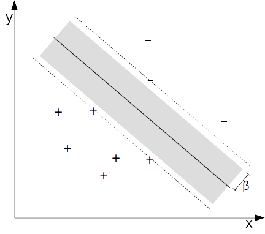
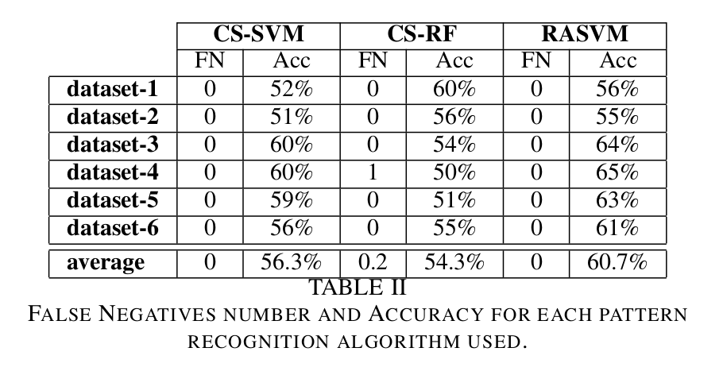

**A COMBINATION OF SUPPORT VECTOR MACHINE AND k-NEAREST NEIGHBORS FOR MACHINE FAULT DETECTION**
 Amaury B. Andre, Eduardo Beltrame & Jacques Wainer
 Pages 36-49 | Published online: 10 Jan 2013

<table width="100%">
	<tr><td align="center">
		
	</td><td>
		 Applied Artificial Intelligence
		 An International Journal
		 Volume 27, 2013 - Issue 1 
		 <a href="https://www.tandfonline.com/doi/abs/10.1080/08839514.2013.747370" target="_blank">https://doi.org/10.1080/08839514.2013.747370</a>
	</td></tr>
</table>

<b>Revision made in 2016: <a href="triagem.pdf" target="_black">PDF</a></b>

### Goal

The aim of this work is to propose an method for automatic fault detection in electric motors, comprehending: data acquisition, signal processing, feature extraction and pattern recognition, applied to real vibration measurements, provided by a predictive maintenance company: SEMEQ. 

### Metodology

The proposed methodology performs automatic diagnosis on electric motor through a binary classification: segregates which electric motors are in normal condition, to which ones are defective. False negative rate (the number of defective motors classified as if they were normal divided by the total number of motors) must be kept as low as possible, in optimal condition it should be null, while classification accuracy must be maximized.  

Support Vector Machine (SVM) is a powerful algorithm for binary classification, due to its ability to perform well with imbalanced and high dimensional data. However, in order to reduce false negative rates to null, an extension of the traditional SVM classifier is used: the Risk Area SVM (RASVM). This algorithm is able to control false negatives through the presupposition that most misclassifications in an SVM classifier are close to the decision boundary. A region close to the SVM's decision boundary is selected, and inside that region, the decision to classify a sample as negative (normal) is based on inspecting if its k nearest neighbors (k-NN) are also negative.

### Results

A total of six datasets were obtained from both healthy and defective motors. Since all measured data were retrieved from predictive maintenance programs, each dataset consist of measurements from one month of monitoring, from many different industries and many different components assemblies. Each dataset consists on the following data:

- dataset 1 - 10833 instances: 10162 healthy and 671 defective motors.
- dataset 2 - 12916 instances: 12074 healthy and 842 defective motors.
- dataset 3 - 12383 instances: 11693 healthy and 690 defective motors.
- dataset 4 - 17449 instances: 16695 healthy and 754 defective motors.
- dataset 5 - 18293 instances: 17442 healthy and 841 defective motors.
- dataset 6 - 18127 instances: 17312 healthy and 815 defective motors.

The goal of the proposed approach is to perform a binary classification, with the best accuracy subjected to the constraint of no false negatives. To compare results, classification accuracy is judged with three classifiers: cost sensitive SVM, cost sensitive Random Forest and RASVM.

<a href="../projetos">Back</a>