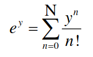

## Threads

Este laboratório cobre os fundamentos de multithreading na linguagem de programação Python. Assim como o multiprocessamento, o multithreading é uma forma de realizar multitarefa. Em multithreading, usaremos o conceito de threads visto em aula.

Em Python, o módulo de `threading` fornece uma API muito simples e intuitiva para gerar vários threads em um programa.

Vamos considerar um exemplo simples usando o módulo de `threading`:


```python
import threading 
  
def print_cube(num): 
    print("Cube: {}".format(num * num * num)) 
  
def print_square(num): 
    print("Square: {}".format(num * num)) 
  
if __name__ == "__main__": 
    # creating threads 
    t1 = threading.Thread(target=print_square, args=(10,)) 
    t2 = threading.Thread(target=print_cube, args=(10,)) 
  
    # starting thread 1 
    t1.start() 
    # starting thread 2 
    t2.start() 
  
    # wait until thread 1 is completely executed 
    t1.join() 
    # wait until thread 2 is completely executed 
    t2.join() 
  
    print("Done!") 
```

Exercício:

Calcular uma aproximação do valor da função exponencial a partir da seguinte série:



De acordo com a série anterior, a precisão do valor da exponencial aumenta quanto maior for o parâmetro `N` utilizado.

Como referência, podesmos assumir o valor exato da função exponencial como sendo o fornecido pela biblioteca `numpy`:

```python
import numpy as np
print(np.exp(y))
```

Em que `y` é o valor do expoente e N o número de termos de aproximação da série.

O objetivo de exercício é computar uma aproximação da função exponencial de `y` usando a fórmula anterior para diferentes valores de `N`.

Usando a biblioteca `threading`, escreva um programa em python que:

- Cria diferentes threads para rodar tarefas em paralelo

- A quantidade de threads é o número de cores da sua CPU menos 1 (8 cores -> pool de 7 processos)

- Escreva uma função que rode em paralelo, chamada py_exp. A função deve receber como parâmetro o valor `N` que especifica o número de termos paa calcular a aproximação da exponenciale o parâmetro `y` para calcular o expoente.

- A função deve imprimir o valor calculado, o valor real e a diferença do calculado para o real.

- Rode as tarefas em paralelo, começando com N=100 e y=10 aumentando em dois o valor de y para cada processo subsequente (por exemplo: 10, 12, 14, 16...)


Por fim, espere todas os threads terminarem e imprima o tempo total decorrido.

Para entregar, façam um relatório descrevendo:

- A configuração da sua máquina (principalmente o número de núcleos)
- O tempo total de execução
- Um print do gerenciador de tarefas ou da saída do comando `top` no linux (para gerar o print, aumente o valor de N, para que dê tempo do print pegar as threads em execução)


<!-- https://events.prace-ri.eu/event/549/sessions/1685/attachments/462/667/Exercise_1_-_multiprocessing.pdf -->
