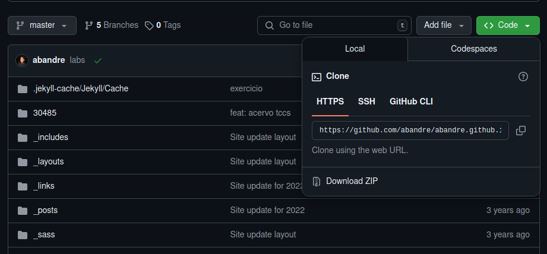

## Versionamento

**Objetivo:** Criar um repositório, adicionar, alterar e ignorar arquivos, além de criar braches, pull requests e merges.

## Introdução

Trabalhar com controle de versão é uma habilidade essencial para qualquer desenvolvedora de software gerenciar sua base de código, acompanhar as alterações e coordenar a colaboração entre uma equipe.

## Roteiro

Nas mensagens de commit que você fizer, sempre insira o seu RA seguida uma mensagem útil.

### Parte 1

Siga os passos propostos neste link: <a href="https://womakerscode.gitbook.io/desvendando-git-e-github/hands-on/exercicio-1" target="_blank"> Parte 1</a>.

- Criando o conteúdo do projeto
- Subindo seu projeto para o GitHub
- Lidando com alterações

### Parte 2

Siga os passos propostos neste link: <a href="https://womakerscode.gitbook.io/desvendando-git-e-github/hands-on/exercicio-2" target="_blank"> Parte 2</a>.

- Criando um arquivo não rastreável
- Gerando o .gitignore
- Publicando seu .gitignore

Verifique no github se os arquivos ignorados foram versionados ou não.

### Parte 3

Siga os passos propostos neste link: <a href="https://womakerscode.gitbook.io/desvendando-git-e-github/hands-on/exercicio-3" target="_blank"> Parte 3</a>.

- Criando sua nova branch & commit de mudanças
- Fazendo Pull Request (PR) & dando merge

### Entrega

Escrever um relatório com os seguintes tópicos:

- Introdução: fazer um breve resumo sobre sistemas de arquivos em sistemas operacionais;
- Resultados: apresentar o print do repositório no github como o exemplo a seguir (exibindo o endereço, os arquivos e mensagens de commit)
- Conclusão

