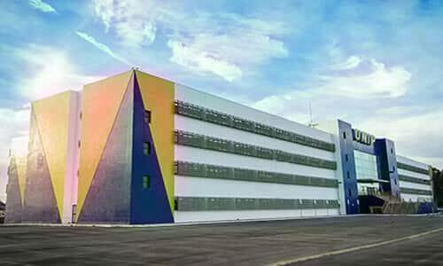

## Cores


**Objetivo:** Desenvolver um programa em python que manipula e processa imagens.

## Introdução

Uma imagem é formada através da distribuição da energia luminosa, em que parte dessa energia é absorvida, parte dela é transmitida, dependendo da opacidade do objeto, e parte é refletida. Essa energia luminosa refletida que é captada pelo nosso olho ou pelas câmeras.


### Bibliotecas

Para a implementação desse lab você muito provavelmente irá precisar instalar as seguintes bibliotecas em python:

 - numpy
 - PIL ou pillow

### Exemplo

```python
from PIL import Image
import numpy as np

img = Image.open('unip.jpg') 
img.show()
img.save('unip2.jpg')
```

Para executar o exemplo anterior, você deve baixar a seguinte imagem no mesmo diretório do código anterior.



### Roteiro

Siga as instruções dos slides de aula a seguir: <a href="lab5/Aula 6 - Cores.pdf" target="_blank">Cores</a>.

- Use o comando `resize` para reamostrar a imagem original (como na página 7);
- Faça o split dos canais (como na página 16)
	- Reamostre o canal vermelho, faça o merge e salve a imagem resultante
	- Reamostre o canal verde, faça o merge e salve a imagem resultante
	- Reamostre o canal azul, faça o merge e salve a imagem resultante

### Entrega

Escrever um relatório com os seguintes tópicos:

- Introdução: fazer um breve resumo sobre entrada e saída em sistemas operacionais;
- Resultados: apresentar as imagens resultantes geradas;
- Conclusão


